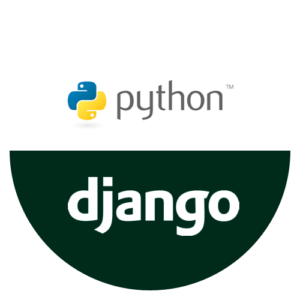

## Hi there 👋, Charlotte here trying to transition into tech from Aeronautical Engineering since February 2022.

<!--
**Charlotte-Natasha/Charlotte-Natasha** is a ✨ _special_ ✨ repository because its `README.md` (this file) appears on your GitHub profile.

Here are some ideas to get you started: -->

- 📖 I’m currently undergoing Code First Girls - Python and Apps course.

- 🌱 I recently completed a Full stack Web Development Course at Moringa school.

- 👯 I’m looking to collaborate on projects, pair-programming and finding a mentor.
- 🤔 I’m looking for help with React as I am self-learning.
- 💬 Ask me about my coding journey a year from now.
- 📫 How to reach me: onyangocharlotte@gmail.com
- 😄 Pronouns: She/Her
- ⚡ Fun fact: I read 5 books every month.

## Connect with me

## 💼 Technical Skills

        
